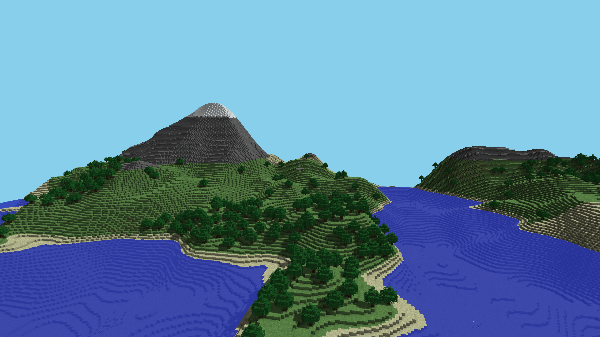
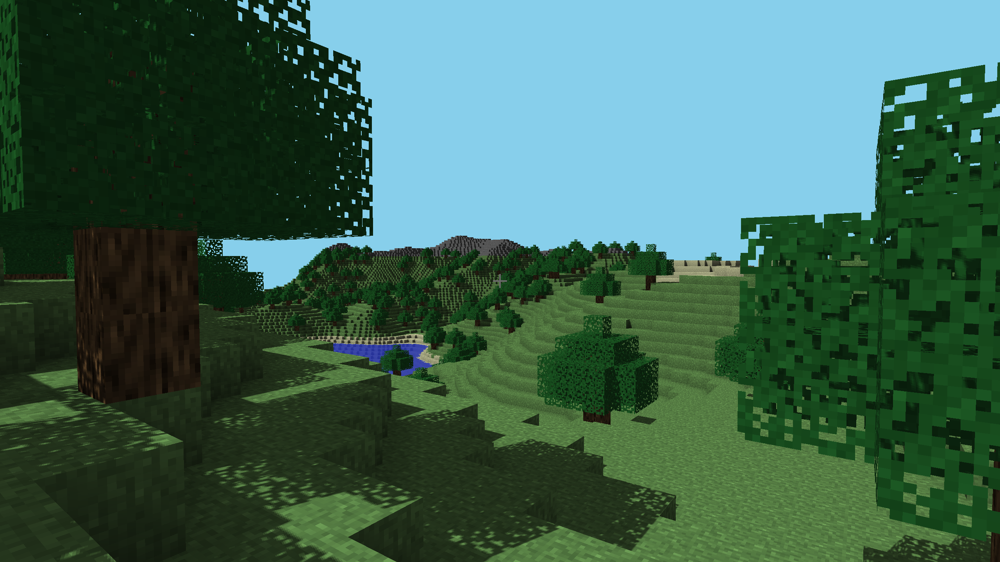
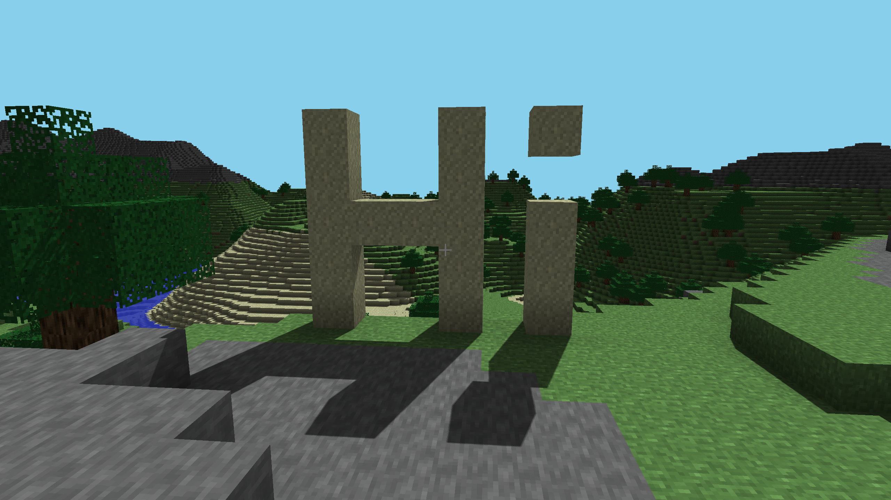

# Voxel Engine

A voxel engine built from the ground up using C++ and OpenGL. 

## Features
- World
  - 32x32x32 chunks
  - Infinite, procedurally generated terrain
  - Breaking and placing blocks
  - Biomes: Ocean, Beach, Forest, Mountains, Snowy Mountains, Plains, Desert
  - Blocks: Grass, Dirt, Stone, Log, Leaves, Sand, Water, Snow
  - Terrain features: Trees
- Lighting
  - Baked ambient occlusion
  - Phong lighting
  - Cascaded shadow mapping
  - Transparency support
- Optimizations
  - Deferred rendering
  - Face culling
  - Backface culling
  - Frustum culling
  - Compressed vertex layout (8 bytes each)
- Entity Component System
  - Currently barebones, but strong foundation laid for future entities to be added
- UI Overlay
  - Minimal configurable settings using ImGui 

 # Screenshots 
 
 
 
